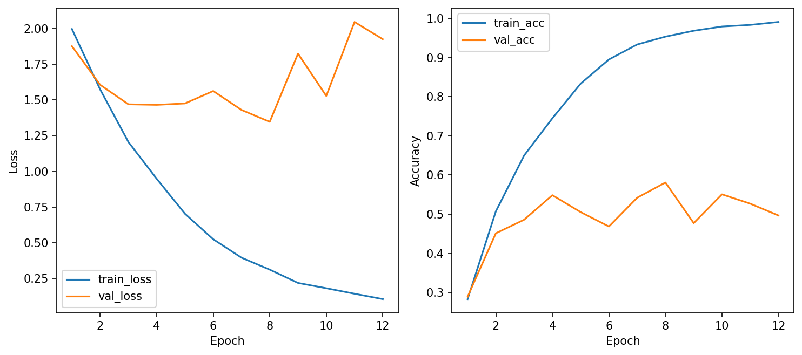
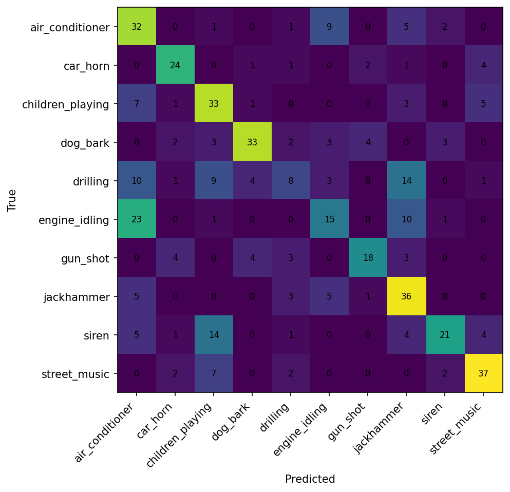
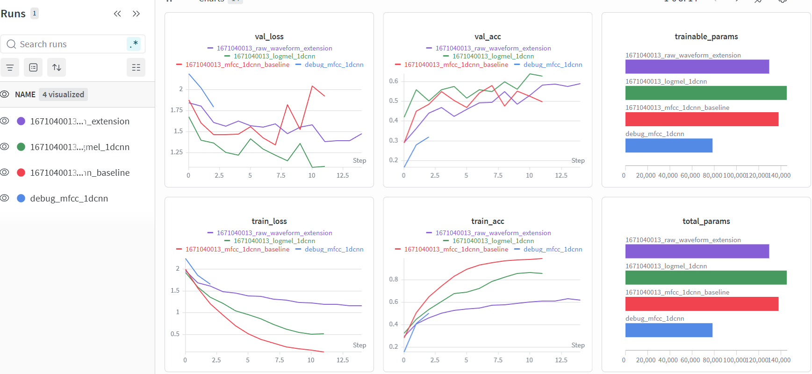

# CSC4005 Lab 3 Report – UrbanSound8K with 1D-CNN

## 1. Thông tin sinh viên

- Họ tên: Nguyễn Văn Huy
- Mã sinh viên: 1671040013
- Lớp: KHMT 16-01
- Link GitHub repo: https://github.com/FIT-DNU-CS-16-01/csc4005-lab3-1dcnn-VTV-24
- Link W&B run/project: [https://wandb.ai/nguyenvanhuy25021982-dai-hoc](https://wandb.ai/nguyenvanhuy25021982-dai-hoc/csc4005-lab3-urbansound-1dcnn?nw=nwusernguyenvanhuy25021982)

---

## 2. Mục tiêu thí nghiệm

Mục tiêu của bài lab là xây dựng hệ thống phân loại âm thanh môi trường trên bộ dữ liệu UrbanSound8K bằng mô hình 1D-CNN.  

Trong bài lab này:
- audio được chuẩn hóa về cùng sample rate và cùng độ dài,
- sử dụng MFCC hoặc log-mel làm chuỗi đặc trưng theo thời gian,
- xây dựng mô hình 1D-CNN để học các pattern âm thanh theo thời gian,
- sử dụng Weights & Biases (W&B) để theo dõi quá trình huấn luyện,
- phân tích kết quả bằng learning curves và confusion matrix.

---

## 3. Dữ liệu và tiền xử lý

### 3.1. Dataset

- Dataset: UrbanSound8K
- Số lớp: 10
- Các lớp:
  - air_conditioner
  - car_horn
  - children_playing
  - dog_bark
  - drilling
  - engine_idling
  - gun_shot
  - jackhammer
  - siren
  - street_music
- Fold dùng để train: fold 1 → fold 8
- Fold dùng để validation: fold 9
- Fold dùng để test: fold 10

### 3.2. Tiền xử lý audio

| Thành phần | Giá trị |
|---|---|
| Sample rate | 16000 Hz |
| Duration | 4.0 giây |
| Feature type | MFCC / log-mel / raw waveform |
| n_mfcc / n_mels | 40 |
| n_fft | 1024 |
| hop_length | 512 |
| Augmentation | Có bật augmentation nhẹ |

Tất cả audio được đưa về cùng sample rate nhằm đảm bảo dữ liệu đầu vào có cùng mật độ lấy mẫu và tránh sự khác biệt giữa các file âm thanh.  

Audio cũng được pad/crop về cùng độ dài để mô hình có thể xử lý batch dữ liệu với kích thước thống nhất. Nếu không đồng nhất độ dài, mô hình sẽ gặp khó khăn trong quá trình huấn luyện.

---

## 4. Mô hình 1D-CNN

Mô hình được sử dụng trong bài lab là kiến trúc 1D-CNN cho chuỗi đặc trưng audio theo thời gian.

```text
Input feature sequence
→ Conv1D block 1
→ Conv1D block 2
→ Conv1D block 3
→ Global Average Pooling
→ Dense classifier
→ Softmax
```

Bảng cấu hình:

| Thành phần | Giá trị |
|---|---|
| model_name | mfcc_1dcnn |
| hidden_channels | 64 |
| dropout | 0.3 |
| optimizer | AdamW |
| learning rate | 1e-3 |
| weight decay | 1e-4 |
| batch size | 32 |
| epochs | 12 |
| patience | 5 |

---

## 5. Kết quả thực nghiệm

### 5.1. Kết quả chính

Kết quả của mô hình baseline MFCC + 1D-CNN:

| Metric | Giá trị |
|---|---:|
| Best validation accuracy | 0.5810 |
| Test accuracy | 0.5527 |
| Average epoch time | 6.99 giây |
| Total parameters | 137,930 |
| Trainable parameters | 137,930 |

### 5.2. Learning curves



Nhận xét:

- Train loss giảm đều theo epoch.
- Train accuracy tăng rất mạnh và gần đạt 1.0 ở cuối quá trình train.
- Validation accuracy cải thiện ở giai đoạn đầu nhưng dao động ở các epoch cuối.
- Validation loss tăng trở lại ở các epoch cuối, cho thấy mô hình bắt đầu overfitting.
- Early stopping không xảy ra nhưng learning curves cho thấy mô hình đã học quá mức trên train set ở giai đoạn cuối.

### 5.3. Confusion matrix



Nhận xét:

- Các lớp như:
  - street_music,
  - dog_bark,
  - car_horn,
  - jackhammer

  được phân loại khá tốt do có đặc trưng âm thanh rõ ràng.

- Một số lớp dễ bị nhầm:
  - drilling ↔ jackhammer
  - engine_idling ↔ air_conditioner

- Nguyên nhân có thể do:
  - các âm thanh máy móc có phổ tần tương đối giống nhau,
  - dữ liệu môi trường chứa nhiều nhiễu nền,
  - một số clip có pattern âm thanh tương tự nhau.

---

## 6. W&B tracking

Link W&B:

```text
https://wandb.ai/nguyenvanhuy25021982-dai-hoc
```

Dashboard W&B được sử dụng để:
- theo dõi learning curves,
- so sánh nhiều run,
- lưu cấu hình huấn luyện,
- theo dõi accuracy/loss theo epoch,
- trực quan hóa confusion matrix.

Ảnh dashboard W&B:



Dashboard bao gồm:
- train_loss,
- val_loss,
- train_acc,
- val_acc,
- total_params,
- trainable_params,
- so sánh giữa baseline, log-mel và raw waveform.

---

## 7. Phân tích và thảo luận

### 1. Vì sao dùng 1D-CNN thay vì MLP cho chuỗi đặc trưng audio?

1D-CNN phù hợp hơn vì audio là dữ liệu chuỗi theo thời gian. Conv1D có khả năng học các pattern cục bộ như biến thiên năng lượng, cao độ hoặc nhịp âm thanh theo thời gian. Trong khi đó, MLP không tận dụng được cấu trúc tuần tự của dữ liệu.

### 2. Kernel 1D trong bài này đang trượt theo chiều nào?

Kernel Conv1D trượt theo chiều thời gian (time axis) của chuỗi đặc trưng audio.

### 3. MFCC giúp mô hình học dễ hơn raw waveform ở điểm nào?

MFCC là biểu diễn đã rút trích thông tin phổ âm thanh quan trọng, giúp:
- giảm số chiều đầu vào,
- loại bỏ bớt nhiễu,
- làm dữ liệu ổn định hơn,
- giúp mô hình hội tụ nhanh hơn.

Trong khi đó raw waveform yêu cầu mô hình phải tự học trực tiếp từ tín hiệu thô.

### 4. Mô hình hiện tại còn hạn chế gì?

- Accuracy vẫn chưa quá cao ở các lớp khó phân biệt.
- Một số lớp máy móc vẫn bị nhầm lẫn mạnh.
- Mô hình baseline có dấu hiệu overfitting.
- Dataset môi trường có nhiều nhiễu nền.

### 5. Có thể cải thiện kết quả bằng cách nào?

- Tăng dữ liệu train hoặc augmentation mạnh hơn.
- Dùng kiến trúc CNN sâu hơn.
- Sử dụng spectrogram 2D với CNN2D.
- Tuning learning rate và regularization.
- Sử dụng pretrained audio model.

---

## 8. Bài mở rộng nếu có

| Pipeline | Feature/Input | Test accuracy | Nhận xét |
|---|---|---:|---|
| Baseline | MFCC + 1D-CNN | 0.5527 | Baseline ổn định, train nhanh |
| Extension 1 | log-mel + 1D-CNN | 0.6043 | Kết quả tốt nhất, learning curves ổn định |
| Extension 2 | raw waveform + 1D-CNN | 0.6022 | Accuracy cao nhưng train rất chậm |

### Nhận xét thêm

- Log-mel + 1D-CNN đạt kết quả tốt nhất với:
  - best validation accuracy cao nhất,
  - validation loss thấp nhất,
  - learning curves ổn định hơn baseline MFCC.

- Raw waveform đạt accuracy khá cao nhưng:
  - thời gian train lâu hơn đáng kể,
  - learning curves dao động hơn,
  - khó hội tụ hơn do phải học trực tiếp từ tín hiệu âm thanh thô.

---

## 9. Kết luận

Qua bài lab này, em đã:
- hiểu được pipeline xử lý audio cho bài toán phân loại âm thanh môi trường,
- biết cách chuẩn hóa audio và trích xuất đặc trưng MFCC/log-mel,
- xây dựng và huấn luyện mô hình 1D-CNN cho chuỗi audio feature,
- sử dụng W&B để theo dõi và so sánh thực nghiệm,
- phân tích learning curves và confusion matrix để đánh giá mô hình.

Kết quả thực nghiệm cho thấy:
- log-mel + 1D-CNN đạt hiệu quả tốt nhất trong các cấu hình đã thử,
- MFCC vẫn là baseline ổn định và phù hợp cho laptop cá nhân,
- raw waveform có tiềm năng nhưng yêu cầu tài nguyên và thời gian huấn luyện lớn hơn đáng kể.
